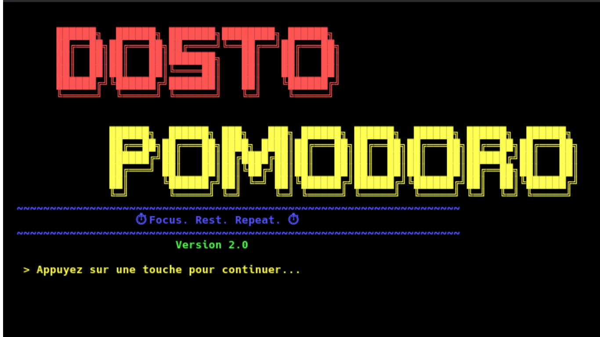

# ⏱️ MINUTEUR POMODORO
A powerful and flexible command-line Pomodoro timer built in C — boost your productivity with timed work sessions, smart break management, and customizable sound alerts!



## 🎯 About
MINUTEUR DOSTO POMODORO is an interactive terminal-based productivity tool written in C that implements the legendary **Pomodoro Technique**. Whether you're a student, developer, or anyone looking to sharpen their focus, this timer guides you through structured work and rest cycles — all from your command line.

**The Method:** Work intensely for a set period, take a short break, and after 4 cycles reward yourself with a long break. Simple, proven, and effective!

## ✨ Features
- 🎛️ **Default Mode** — Jump straight in with the classic Pomodoro setup: 25 min work / 5 min short break / 30 min long break, no configuration needed
- ⚙️ **Custom Mode** — Full control over your session: set your own work duration, short break, and long break lengths to match your workflow
- 🔔 **Sound Alerts** — Choose from a collection of clock sounds stored in `pomodoro_files/pomodoro_clock_sounds/` to get notified at the end of each session
- ⏸️ **Break Management** — Automatically tracks short and long breaks, cycling through them intelligently after every 4 work sessions
- 🖥️ **Command-line Interface** — Lightweight, distraction-free terminal experience that runs anywhere
- 📊 **Session Awareness** — The timer knows where you are in your cycle, keeping your breaks and work sessions in perfect order

## ⏰ The Pomodoro Technique
The Pomodoro Technique was developed by Francesco Cirillo in the late 1980s as a time management method. It breaks work into focused intervals separated by short rest periods.

**This tool implements the full cycle:**

| Phase | Default Duration | Description |
|-------|-----------------|-------------|
| 🍅 Work Session | 25 minutes | Deep, focused work |
| ☕ Short Break | 5 minutes | Quick mental reset |
| 🌿 Long Break | 30 minutes | Full recovery after 4 repetitions |

After completing **4 work repetitions**, the timer automatically transitions to a long break before resetting the cycle.

## 🚀 Quick Start

### Prerequisites
- GCC compiler (or any C compiler)
- Make utility
- A Unix-like terminal (Linux, macOS, or Windows with WSL)

### Installation

1. Clone the repository:
```bash
git clone https://github.com/Dostofine/MINUTEUR_POMODORO.git
cd MINUTEUR_POMODORO
```

2. Compile the project:
```bash
make
```

Or compile manually:
```bash
gcc -o pomodoro src/*.c -I include
```

3. Run the timer:
```bash
make run
```

## 📁 Project Structure
```
MINUTEUR_POMODORO/
├── src/                          # C source files (timer logic, input handling)
├── include/                      # Header files
├── build/                        # Compiled output
├── docs/                         # Documentation and screenshots
├── pomodoro_files/
│   └── pomodoro_clock_sounds/   # Alert sound files for session end notifications
├── .vscode/                      # VS Code workspace configuration
├── .gitignore                    # Git ignored files
├── Makefile                      # Build automation
├── LICENSE                       # MIT License
└── README.md                     # This file
```

## 🛠️ Built With
- **Language:** C
- **Compilation:** GCC / Make
- **Platform:** Cross-platform (Linux, macOS, Windows via WSL)

## 🎓 Learning Outcomes
By building and using this project, you'll explore:
- Implementing real-time countdowns and timers in C
- Managing program state across multiple cycles and phases
- Handling user input and menu-driven interfaces in the terminal
- Working with file I/O to load and play sound assets
- Structuring a multi-file C project with headers and a Makefile
- Applying a real-world productivity technique through code

## 📝 License
This project is licensed under the MIT License — see the [LICENSE](LICENSE) file for details.

## 👨‍💻 Author
**Dostofine**
- GitHub: [@Dostofine](https://github.com/Dostofine)

## 🌟 Acknowledgments
- Inspired by Francesco Cirillo's Pomodoro Technique
- Built as a learning project to deepen C programming skills
- Thanks to everyone who tries it out and gives feedback!

## 💡 Future Ideas
- [✓] Custom session durations
- [✓] Multiple sound alert options
- [ ] Visual progress bar in the terminal
- [ ] Session history and statistics log
- [ ] Notification popup support (desktop alerts)
- [ ] Config file to save preferred settings
- [ ] Color-coded terminal output (work vs break phases)
- [ ] Pause and resume functionality

---

**Stay focused, take your breaks, and crush your goals! 🍅**

If this project helped your productivity, please consider giving it a ⭐!